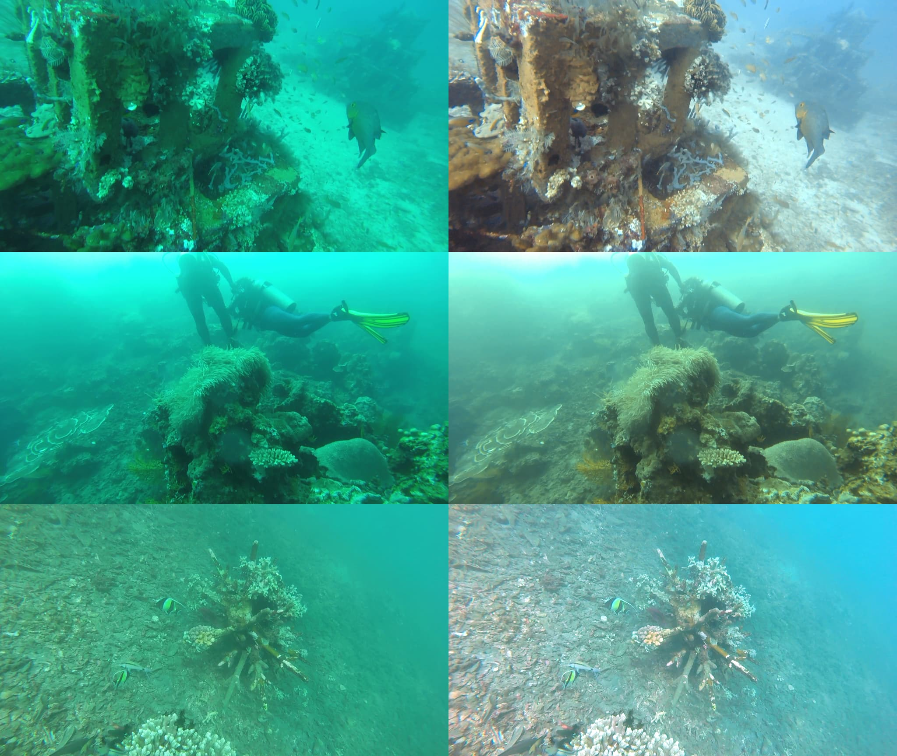

## Dive and underwater image and video color correction

This Python code fixes the colors of your dive and underwater photos and images.

Inspired by the algorithm at https://github.com/nikolajbech/underwater-image-color-correction.



### Setup
```
$ pip install -r requirements.txt
```


### For images
```
$ python correct.py image /my/raw.png /my/corrected.png
```

### For videos
```
$ python correct.py video /my/raw.mp4 /my/corrected.mp4
```